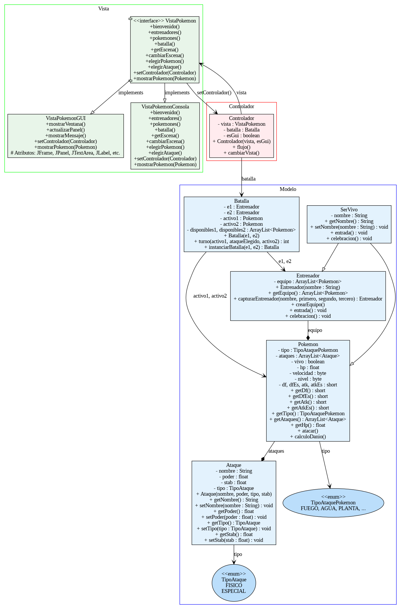
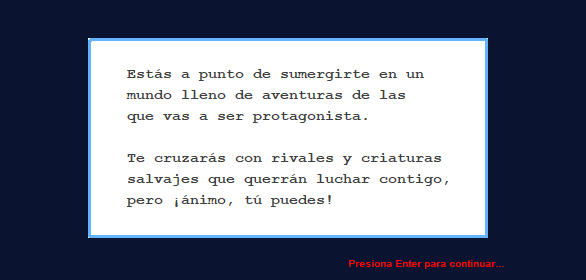
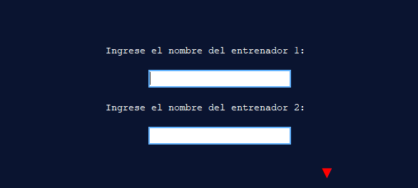
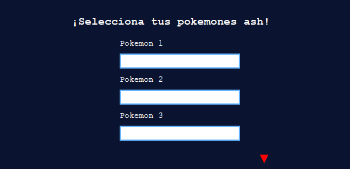
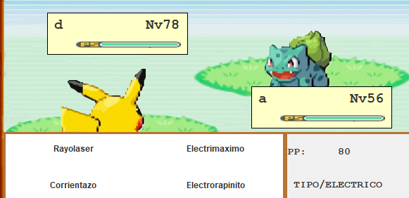
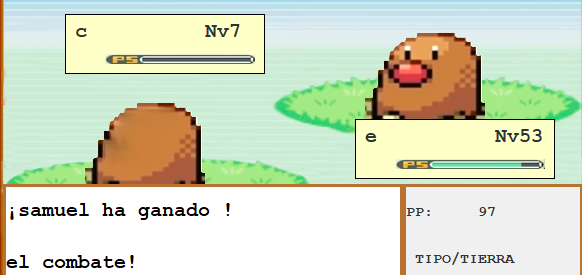

# 🎮 Pokémon Battle Simulator MVC Versión final SSSJ


Una aplicación de escritorio desarrollada en Java, diseñada bajo el patrón de arquitectura MVC (Modelo-Vista-Controlador),que simula combates entre Pokémones, permitiendo al usuario utilizar sus Pokémones y disfrutar de una experiencia interactiva tipo videojuego.

--- 

## 📚 Tabla de Contenidos

- [🎯 Descripción](#-descripción)
- [📐 Arquitectura MVC](#-arquitectura-mvc)
- [👥 Integrantes](#-integrantes)
- [⚙️ Tecnologías Utilizadas](#️-tecnologías-utilizadas)
- [📦 Estructuras de datos utilizadas](#-estructuras-de-datos-utilizadas)
- [📁 Estructura del Código](#-estructura-del-código)
- [🧠 Diagrama UML](#-diagrama-uml)
- [🚀 Instalación y Ejecución](#-instalación-y-ejecución)
- [🖼️ Capturas de Pantalla](#-capturas-de-pantalla)
- [🧠 Retos y Aprendizajes](#-retos-y-aprendizajes)

---

## 🎯 Descripción

Este proyecto tiene como objetivo la creación de una GUI en Java para simular combates Pokémon con interfaz intuitiva y que implementa el patrón de arquitectura MVC (Modelo-Vista-Controlador). Los jugadores pueden utilizar habilidades especiales y experimentar un sistema de combate por turnos.

---

## 📐 Arquitectura MVC

- **Modelo**: contiene las clases que representan la lógica de negocio y los datos (Pokémon, Entrenadores, Batallas, etc.).

- **Vista**: construida con Swing/NetBeans, representa la GUI que el usuario utiliza.

- **Controlador**: maneja la interacción entre la Vista y el Modelo, coordinando eventos y actualizaciones.

---

## 👥 Integrantes

- Samuel Agudelo Sosa - Código: 202459419
- Sebastián Saenz Mejia - Código: 202459528
- Samuel Romero Martinez - Código: 202459464
- José Manuel Castaño Rojas - Código 202459522

---

## ⚙️ Tecnologías Utilizadas

- ☕ Java
- 🔧 Git y Github
- 📁 Kanban (Trello o Github projects)
- 🖼️ Neatbens para la GUI
- 🧪 UML para diseño de clases y arquitectura
- 🧠 POO (Programación Orientada a Objetos)
- 🔔 Programación orientada a eventos
- 🏛️ MVC (Modelo-Vista-Controlador)

---


## 📦 Estructuras de datos utilizadas 

En el desarrollo de este simulador Pokémon se emplearon varias estructuras de datos de la biblioteca estándar de Java para modelar y gestionar la información de manera eficiente:

### 1. **ArrayList**
- **¿Dónde se usa?**
  - Para almacenar los equipos de Pokémon de cada entrenador (`ArrayList<Pokemon>` en la clase `Entrenador`).
  - Para manejar la lista de ataques de cada Pokémon (`ArrayList<Ataque>` en la clase `Pokemon`).
  - Para gestionar listas temporales de nombres y batallas en el `Controlador`.
- **¿Por qué se usa?**
  - Permite almacenar colecciones dinámicas de objetos, acceder a ellos por índice y recorrerlos fácilmente, lo cual es ideal para equipos de tamaño variable y listas de ataques.

### 2. **LinkedList**
- **¿Dónde se usa?**
  - Para gestionar el orden de los Pokémon en combate (`LinkedList<Pokemon>` en la clase `Controlador`).
  - Para el método `ordenBatalla` en la clase `Batalla`, que retorna un `LinkedList<Pokemon>` con el orden de ataque.
- **¿Por qué se usa?**
  - Permite inserciones y eliminaciones eficientes al principio y final de la lista, lo cual es útil para manejar el turno de los Pokémon en combate.

### 3. **Deque (como Pila)**
- **¿Dónde se usa?**
  - En la clase `HistorialAtaques`, se utiliza un `Deque<Ataque>` (implementado con `LinkedList`) para almacenar el historial de ataques como una **pila** (estructura LIFO).
- **¿Por qué se usa?**
  - Permite agregar y quitar ataques del historial de manera eficiente, manteniendo solo los últimos ataques realizados (hasta un límite).

### 4. **HashMap**
- **¿Dónde se usa?**
  - En la clase `TipoAtaquePokemon` para la tabla de efectividad entre tipos de Pokémon (`Map<TipoAtaquePokemon, Map<TipoAtaquePokemon, Float>>`).
  - En la clase `VistaPokemonGUI` para asociar tipos de Pokémon con sus respectivos íconos (`Map<TipoAtaquePokemon, ImageIcon>`).
  - En la clase `ManejadorLogros` para registrar los logros desbloqueados (`Map<Logros, Entrenador>`).
- **¿Por qué se usa?**
  - Permite realizar búsquedas rápidas por clave, ideal para consultar la efectividad de un tipo contra otro, obtener la imagen correspondiente a un tipo de Pokémon o gestionar logros.

### 5. **List (Interfaz)**
- **¿Dónde se usa?**
  - En la clase `Entrenador` para crear listas inmutables de nombres de Pokémon al capturarlos (`List.of(...)`).
- **¿Por qué se usa?**
  - Proporciona flexibilidad para trabajar con diferentes implementaciones de listas y garantiza que la colección no se modifique accidentalmente.

### 6. **Otros**
- **Enum**: Se usan para representar tipos de ataques (`TipoAtaque`, `TipoAtaquePokemon`) y logros (`Logros`), facilitando la gestión de constantes y comportamientos asociados.
- **Array**: Se usa internamente en los enums para almacenar los nombres de ataques por tipo.

---

## 📁 Estructura del Código

```bash
Pokemon_MVC/
│
│                       
├── src/
│   ├── image/                   # Imágenes utilizadas
│   ├── controlador/             # Lógica de control
│   ├── modelo/                  # Clases de negocio y datos
│   ├── vista/                   # Interfaces gráficas (GUI), y vista por consola
│   ├── App.java/                # Archivo desde el cual se ejecuta todo el juego
│   
│
├── .gitignore
└── README.md
```

---

### 📊 Diagrama UML del Juego


---

## 🚀 Instalación y ejecución
1. Clonar el repositorio:  
   ```bash
   git clone https://github.com/saenz22/Pokemon_SSSJ.git

## 🖼️ Capturas de Pantalla

Pantalla Prinicipal



Selección de entrenadores



Selección de pokemones




Combate





---

## 🧠 Retos y Aprendizajes

- Implementación de POO y herencia entre clases Pokémon.
- Manejo de eventos en interfaces gráficas.
- Modelado de clases con UML.
- Coordinación en equipo para dividir responsabilidades.
- Diseño de interfaces amigables al usuario.
- Diseño de software con MVC.
- Manejo de eventos en GUIs.
- Persistencia de datos para guardar y cargar partidas.
- Manejo de excepciones personalizadas para flujos de juego y errores de usuario.
- Implementación de logros y ranking de jugadores.
- Sincronización entre la lógica de la GUI y la consola.
- Uso de estructuras de datos avanzadas (pilas, listas enlazadas, mapas).
- Modularización del código para facilitar el mantenimiento y la escalabilidad.
- Pruebas y depuración de la lógica de combate por turnos.
- Integración de imágenes y recursos multimedia en la interfaz.
- Documentación y buenas prácticas en el desarrollo colaborativo.
